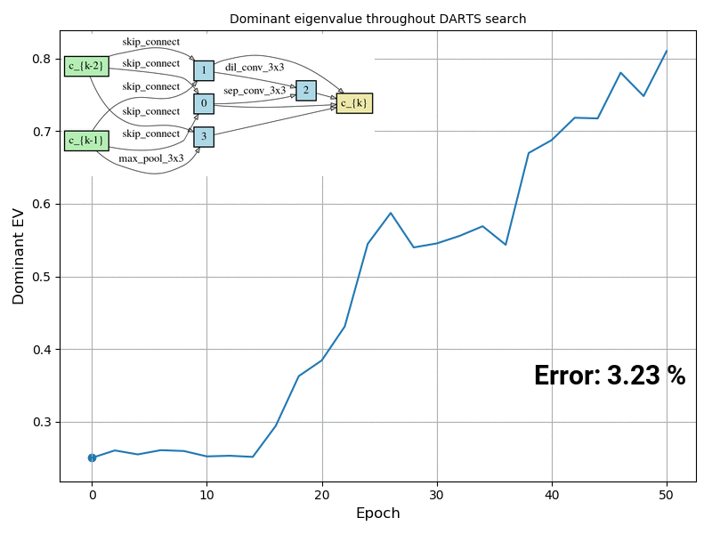

# RobustDARTS
Code accompanying the paper:
> [Understanding and Robustifying Differentiable Architecture Search](https://arxiv.org/abs/1909.09656)\
> Arber Zela, Thomas Elsken, Tonmoy Saikia, Yassine Marrakchi, Thomas Brox and Frank Hutter.\
> _arXiv:1909.09656_.

# Codebase
The code is basically based on the original [DARTS implementation](https://github.com/quark0/darts).

## Requirements
```
Python >= 3.5.5, PyTorch == 0.3.1, torchvision == 0.2.0
```

As we show in our paper, DARTS will start assigning a large weight to skip connections as the search progresses, while at the same time the dominant eigenvalue of the validation loss Hessian starts increasing.

<p align="center">

</p>
<p align="center">
Figure: Snapshot of the normal cells and dominant eigenvalue of the Hessian of the validation loss w.r.t. the architectural parameters over time.
</p>

## Architecture search 
To carry out the DARTS (2nd order) architecture search on all search spaces and datasets used throughout the paper, run:
```
./scripts/start_search.sh
```
> NOTE: We used the [Slurm Workload Manager](https://slurm.schedmd.com/) environment to run our jobs, but it can be easily adapted to other job scheduling systems.


To carry out the DARTS-ADA and DARTS-ES (2nd order) architecture search on all search spaces and datasets, run:
```
./scripts/start_search_ADA.sh
```
Since, DARTS-ES and DARTS-ADA work with the same stopping criterion, we do not need to run them separately, but instead we just start DARTS-ADA and log the architectures after the first rollback iteration, supposing that DARTS would early stop, and then continue with the adapting regularization.

To start Random Search with Weight Sharing on all search spaces and datasets used throughout the paper, run:
```
./scripts/start_search_RandomNAS.sh
```

## Architecture evaluation
To start evaluating all the architectures logged by the search runs, run:
```
./scripts/start_eval.sh
```
Make sure to set `--archs_config_file` to the correct `.yaml` file where the architecture genotypes are saved.


## Citation
```
@inproceedings{zela-arxiv19a,
	author = {A. Zela and T. Elsken and T. Saikia and Y. Marrakchi and T. Brox and F. Hutter},
	journal = {arXiv:1909.09656 [cs.LG]},
	month = sep,
	title = {Understanding and Robustifying Differentiable Architecture Search},
	url = {https://arxiv.org/abs/1905.07443},
	year = {2019}
}
```
